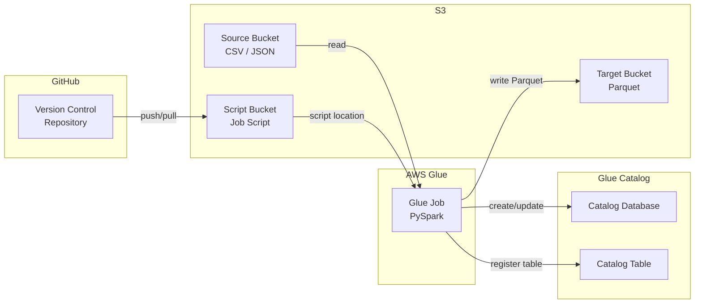

# Feature Design: Glue S3-to-Catalog ETL Job

## Overview

This feature delivers a sample AWS Glue ETL job implemented in PySpark that reads data from an S3 source bucket (CSV or JSON), writes the processed output in Parquet format to a target S3 bucket, and registers the dataset as a table in the AWS Glue Data Catalog. The project is structured as infrastructure-as-code using AWS CloudFormation, with the entire codebase stored in a GitHub repository for version control.

The design prioritizes configurability (all paths, database names, and table names are job parameters), correctness (data fidelity through format conversions), and repeatability (CloudFormation for provisioning).

## Architecture



### Flow

1. The Glue Job is triggered (manually or via schedule).
2. Job parameters are resolved: `source_path`, `target_path`, `catalog_database`, `catalog_table_name`, and optional `partition_key`.
3. The job reads data from `source_path` in S3, auto-detecting CSV or JSON format.
4. The job writes the resulting DynamicFrame to `target_path` in Parquet format, optionally partitioned.
5. The job creates the Catalog Database if it does not exist, then creates or updates the Catalog Table pointing to the target path.
6. The job exits with a success or failure status code.

## Components and Interfaces

### 1. Job Script (`glue_job.py`)

The main PySpark script executed by the Glue Job.

**Responsibilities:**
- Parse and validate job parameters using `GlueContext.getResolvedOptions`.
- Read data from the source S3 path into a DynamicFrame.
- Write the DynamicFrame to the target S3 path in Parquet format.
- Register or update the Catalog Table in the specified Catalog Database.

**Key Functions:**

| Function | Input | Output | Description |
|---|---|---|---|
| `parse_args(sys_args)` | `list[str]` | `dict` with keys: `source_path`, `target_path`, `catalog_database`, `catalog_table_name`, `partition_key` (optional) | Parses and validates job parameters. Raises `ValueError` for missing required params. |
| `read_source(glue_context, source_path)` | `GlueContext`, `str` | `DynamicFrame` | Reads CSV or JSON from S3 into a DynamicFrame. Logs warning and returns `None` if path is empty. |
| `write_target(glue_context, dynamic_frame, target_path, partition_key)` | `GlueContext`, `DynamicFrame`, `str`, `Optional[str]` | `None` | Writes DynamicFrame to S3 in Parquet format, optionally partitioned. |
| `register_catalog(glue_context, dynamic_frame, catalog_database, catalog_table_name, target_path)` | `GlueContext`, `DynamicFrame`, `str`, `str`, `str` | `None` | Creates database if missing, then creates/updates the Catalog Table with schema from the DynamicFrame. |
| `detect_format(source_path)` | `str` | `str` ("csv" or "json") | Detects file format from the S3 path extension. Defaults to CSV if ambiguous. |

### 2. Infrastructure Code (`cloudformation/template.yaml`)

A CloudFormation template that provisions all required AWS resources.

**Resources defined:**
- `GlueJob` — the ETL job resource with configurable script location, Glue version (4.0), worker type, worker count, and `SourceControlDetails` linking to `https://github.com/vijithaglue/Glue-jobs`.
- `GlueJobRole` — IAM role with policies scoped to the source bucket, target bucket, script bucket, Glue Catalog, and Secrets Manager (for the GitHub PAT).
- `ScriptBucket` — S3 bucket for storing the job script.
- `GitHubPATSecret` (referenced, not created) — AWS Secrets Manager secret at `glue/github-pat` storing the GitHub Personal Access Token.

**Parameters:**
- `SourceBucketArn` — ARN of the source S3 bucket.
- `TargetBucketArn` — ARN of the target S3 bucket.
- `GlueVersion` — Glue version (default: `4.0`).
- `WorkerType` — Worker type (default: `G.1X`).
- `NumberOfWorkers` — Number of workers (default: `2`).
- `GitHubRepository` — GitHub repository in `owner/repo` format (default: `vijithaglue/Glue-jobs`).
- `GitHubBranch` — Branch name (default: `main`).

### 3. Version Control Setup

**GitHub Repository:** `https://github.com/vijithaglue/Glue-jobs`

**PAT Token Configuration:**

The GitHub Personal Access Token (PAT) is stored in AWS Secrets Manager and referenced by the Glue Job's source control configuration. This avoids hardcoding credentials.

1. Store the PAT in Secrets Manager:
   - Secret name: `glue/github-pat`
   - Secret value: `{"token": "<your-github-pat>"}`
   - You can create this via the AWS Console (Secrets Manager → Store a new secret → Other type of secret) or via CLI.

2. The CloudFormation template configures the Glue Job with `SourceControlDetails`:
   ```yaml
   SourceControlDetails:
     Provider: GITHUB
     Repository: vijithaglue/Glue-jobs
     Branch: main
     Folder: glue_scripts
     AuthStrategy: PERSONAL_ACCESS_TOKEN
     AuthToken: !Sub "{{resolve:secretsmanager:glue/github-pat:SecretString:token}}"
   ```

3. Once deployed, the Glue console "Version control" tab for the job will show the linked GitHub repo. You can push/pull directly from the console.

**Local Git Setup:**
- `.gitignore` — excludes `__pycache__/`, `*.pyc`, `.env`, `cdk.out/`, `*.egg-info/`, and other build artifacts.
- `README.md` — documents project structure, setup, job parameters, and deployment.
- Remote: `git remote add origin https://github.com/vijithaglue/Glue-jobs.git`
- Standard workflow: `git add .`, `git commit`, `git push origin main`, `git pull origin main`.

## Data Models

### Job Parameters

```python
@dataclass
class JobParams:
    source_path: str        # s3://source-bucket/path/to/data/
    target_path: str        # s3://target-bucket/path/to/output/
    catalog_database: str   # e.g. "my_database"
    catalog_table_name: str # e.g. "my_table"
    partition_key: Optional[str] = None  # e.g. "date"
```

### DynamicFrame Schema (runtime)

The schema is inferred at runtime from the source data. No static schema is defined — the Glue job preserves whatever columns/fields exist in the source.

### Catalog Table Metadata

| Field | Value |
|---|---|
| Database | Value of `catalog_database` parameter |
| Table Name | Value of `catalog_table_name` parameter |
| Location | Value of `target_path` parameter |
| Input Format | `org.apache.hadoop.hive.ql.io.parquet.MapredParquetInputFormat` |
| Output Format | `org.apache.hadoop.hive.ql.io.parquet.MapredParquetOutputFormat` |
| SerDe | `org.apache.hadoop.hive.ql.io.parquet.serde.ParquetHiveSerDe` |
| Columns | Derived from DynamicFrame schema at write time |


## Correctness Properties

*A property is a characteristic or behavior that should hold true across all valid executions of a system-essentially, a formal statement about what the system should do. Properties serve as the bridge between human-readable specifications and machine-verifiable correctness guarantees.*

### Property 1: Parameter parsing extracts all provided values

*For any* valid set of job parameters containing `source_path`, `target_path`, `catalog_database`, `catalog_table_name`, and optionally `partition_key`, calling `parse_args` SHALL return a dictionary where each key maps to the exact value that was provided.

**Validates: Requirements 4.1**

### Property 2: Missing required parameter detection

*For any* set of job parameters where at least one required parameter (`source_path`, `target_path`, `catalog_database`, `catalog_table_name`) is absent, calling `parse_args` SHALL raise a `ValueError` whose message contains the name of the missing parameter.

**Validates: Requirements 4.2**

### Property 3: CSV data preservation through ETL pipeline

*For any* well-formed CSV dataset with arbitrary column names and string/numeric values, reading the CSV into a DynamicFrame and writing it as Parquet SHALL preserve all column names and all cell values (compared as strings after type coercion).

**Validates: Requirements 7.1, 1.2**

### Property 4: JSON data preservation through ETL pipeline

*For any* well-formed JSON dataset (array of flat objects) with arbitrary field names and string/numeric/boolean values, reading the JSON into a DynamicFrame and writing it as Parquet SHALL preserve all field names and all values.

**Validates: Requirements 7.2, 1.3**

### Property 5: Parquet serialization round-trip

*For any* DynamicFrame with a known schema and row data, writing the DynamicFrame as Parquet and reading it back SHALL produce a DynamicFrame with equivalent column names, column types, and row data.

**Validates: Requirements 7.3**

### Property 6: Partition key controls partitioning behavior

*For any* DynamicFrame and any optional `partition_key` value (either a valid column name or `None`), calling `write_target` SHALL partition the output by that column when `partition_key` is a valid column name, and SHALL write without partitioning when `partition_key` is `None`.

**Validates: Requirements 2.2, 4.3**

## Error Handling

| Scenario | Behavior | Exit Code |
|---|---|---|
| Missing required job parameter | Log error identifying the missing parameter | Failure (1) |
| Source path contains no files | Log warning message | Success (0) |
| Source path unreachable / access denied | Log error with exception details | Failure (1) |
| Write to target path fails | Log error with exception details | Failure (1) |
| Catalog database does not exist | Create the database, then proceed | Success (0) |
| Catalog table registration fails | Log error with exception details | Failure (1) |

Error handling is implemented using Python try/except blocks. All errors are logged using the Python `logging` module at the appropriate level (WARNING for empty source, ERROR for failures). The Glue job uses `sys.exit(0)` for success and `sys.exit(1)` for failure.

## Testing Strategy

### Testing Framework

- **Unit tests**: `pytest` for standard unit and integration tests.
- **Property-based tests**: `hypothesis` library for Python property-based testing. Each property test runs a minimum of 100 iterations.
- Since the Glue job runs in a PySpark/Glue environment, tests that exercise DynamicFrame operations will use `pyspark` locally with a `SparkSession` and convert between Spark DataFrames and simulated DynamicFrames. Pure logic functions (`parse_args`, `detect_format`) are tested directly.

### Unit Tests

- Verify `parse_args` with specific known-good and known-bad parameter sets.
- Verify `detect_format` returns `"csv"` for `.csv` paths and `"json"` for `.json` paths.
- Verify error handling for empty source path (returns `None`, logs warning).
- Verify CloudFormation template structure (required resources, parameters, IAM policy scoping).

### Property-Based Tests

Each property-based test is annotated with the format: `**Feature: glue-s3-catalog-job, Property {number}: {property_text}**`

| Property | Test Description | Generator Strategy |
|---|---|---|
| Property 1 | Generate random valid parameter dicts, serialize to arg list, parse, compare | Random strings for paths/names, optional partition_key |
| Property 2 | Generate parameter dicts with at least one required key removed, verify ValueError | Random subsets of required params |
| Property 3 | Generate random tabular data as CSV, run through read→write pipeline, compare | Random column names (alphanumeric), random string/int values |
| Property 4 | Generate random flat JSON objects, run through read→write pipeline, compare | Random field names, random string/int/bool values |
| Property 5 | Generate random Spark DataFrames, write as Parquet, read back, compare | Random schemas with string/int/float columns, random row data |
| Property 6 | Generate DataFrames with a known column, call write_target with and without partition_key, verify output structure | Random DataFrames, random column selection or None |

Each correctness property is implemented by a single property-based test. Unit tests complement property tests by covering specific edge cases and integration points.
