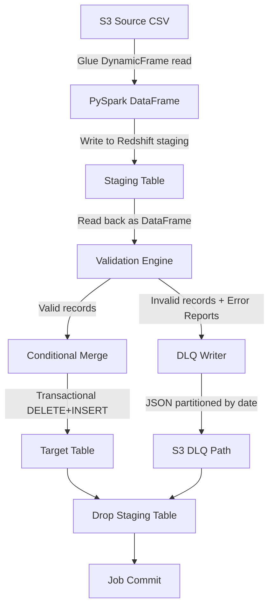
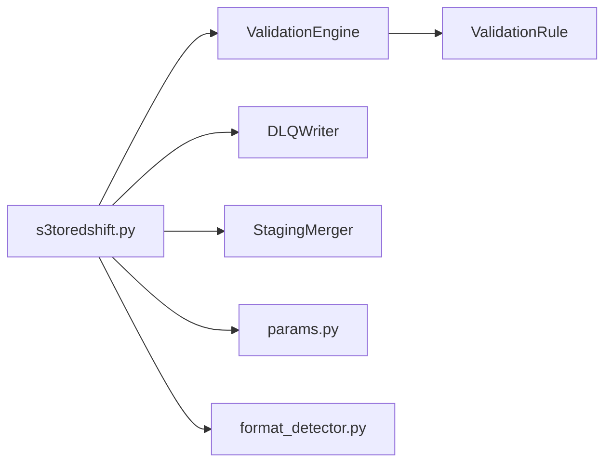

# Design Document: S3-Redshift Staging DLQ

## Overview

This design enhances the existing `s3toredshift` Glue job with three new capabilities layered between the S3 read and the Redshift target-table swap:

1. **Validation Engine** — a pure-Python component that evaluates configurable rules (`not_null`, `regex`) against every record in the staging DataFrame, classifying each as valid or invalid and collecting per-record error reports.
2. **DLQ Writer** — writes invalid records (with attached `_validation_errors` metadata) to a date-partitioned S3 path in JSON format.
3. **Conditional Merge** — replaces the current blanket `DELETE + INSERT` postaction with a selective merge that only promotes valid records to the target table.

The design keeps the validation logic as pure functions operating on PySpark DataFrames so that it can be unit-tested and property-tested without Glue or Redshift infrastructure. The Glue-specific orchestration (reading S3, writing Redshift, writing DLQ to S3) remains in the job script.

### Key Design Decisions

| Decision | Rationale |
|---|---|
| Validation runs on PySpark DataFrame, not Redshift SQL | Keeps validation logic testable without a Redshift cluster; leverages Spark's distributed processing for large datasets. |
| Rules defined as a Python list of dicts | Simple, no external config file needed; can be promoted to a Glue job parameter or SSM parameter later. |
| DLQ written via Spark DataFrame `write.json()` | Avoids a second Glue DynamicFrame round-trip; native Spark JSON writer handles partitioning natively. |
| Merge uses Redshift JDBC postactions | Reuses the existing Glue `write_dynamic_frame.from_jdbc_conf` pattern already in the codebase. |
| Staging cleanup in a `finally` block | Ensures the staging table is dropped even on failure, matching Requirement 7. |

## Architecture



### Processing Flow

1. **Read** — Read CSV from S3 into a Glue DynamicFrame, convert to Spark DataFrame.
2. **Stage** — Write all records to the Redshift staging table (drop + recreate via preactions).
3. **Validate** — Apply all configured validation rules against the DataFrame in a single pass. Each record gets a `_validation_errors` column (empty list = valid, non-empty = invalid).
4. **Split** — Filter into `valid_df` and `invalid_df` based on `_validation_errors`.
5. **DLQ** — If `invalid_df` is non-empty, write to S3 DLQ path partitioned by `year/month/day`.
6. **Merge** — If `valid_df` is non-empty, write valid records to staging table and execute transactional swap into target table via postactions.
7. **Cleanup** — Drop staging table in a `finally` block.

## Components and Interfaces

### 1. `ValidationRule` (dataclass)

Represents a single validation rule configuration.

```python
@dataclass
class ValidationRule:
    rule_type: str        # "not_null" or "regex"
    column: str           # target column name
    pattern: str = None   # regex pattern (only for "regex" type)
    rule_name: str = None # optional human-readable name, auto-generated if omitted
```

**Factory method**: `ValidationRule.from_dict(d: dict) -> ValidationRule` — parses a rule dictionary into a `ValidationRule` instance.

### 2. `ValidationEngine`

Pure-function module that operates on PySpark DataFrames.

```python
def validate(df: DataFrame, rules: List[ValidationRule], schema_columns: List[str]) -> DataFrame:
    """Apply all rules to df, adding a '_validation_errors' array column.
    
    Rules referencing non-existent columns are skipped with a warning log.
    Returns the original DataFrame with the additional column.
    """

def split_valid_invalid(validated_df: DataFrame) -> Tuple[DataFrame, DataFrame]:
    """Split a validated DataFrame into (valid_df, invalid_df).
    
    valid_df: rows where _validation_errors is empty (column dropped).
    invalid_df: rows where _validation_errors is non-empty (column retained).
    """
```

**Rule evaluation internals** (single-pass):
- For each rule, produce a `StructType` error entry `{rule_name, column, value}` when the check fails, or `null` when it passes.
- Collect all per-rule columns into an array, filter out nulls → `_validation_errors`.

### 3. `DLQWriter`

Writes invalid records to S3 in partitioned JSON format.

```python
def write_dlq(invalid_df: DataFrame, dlq_base_path: str, job_run_date: date) -> int:
    """Write invalid records to S3 DLQ path.
    
    Path pattern: <dlq_base_path>/year=YYYY/month=MM/day=DD/
    Format: JSON, one object per line.
    Each record includes original fields + _validation_errors.
    
    Returns the number of records written.
    """
```

### 4. `StagingMerger`

Handles the conditional merge of valid records into the target table.

```python
def build_merge_preactions(staging_table: str, target_table: str) -> str:
    """Build the SQL preactions string for staging table setup."""

def build_merge_postactions(staging_table: str, target_table: str) -> str:
    """Build the SQL postactions string for transactional merge."""
```

The merge SQL follows the existing pattern:
```sql
BEGIN TRANSACTION;
DELETE FROM target_table;
INSERT INTO target_table SELECT * FROM staging_table;
DROP TABLE IF EXISTS staging_table;
END TRANSACTION;
```

### 5. `JobOrchestrator` (updated `s3toredshift.py`)

The main job script is refactored to call the above components in sequence, wrapped in try/finally for staging cleanup.

```python
def run_job(glue_context, spark, args, validation_rules):
    """Main job orchestration logic."""
    # 1. Read from S3
    # 2. Check record count (exit if 0)
    # 3. Write to staging table
    # 4. Validate
    # 5. Write DLQ (if invalid records exist)
    # 6. Merge valid records (if any exist)
    # 7. Cleanup staging table (in finally)
    # 8. Log metrics
```

### Component Dependency Diagram



## Data Models

### ValidationRule Configuration Format

```python
VALIDATION_RULES = [
    {"rule_type": "not_null", "column": "vendor_id"},
    {"rule_type": "not_null", "column": "pickup_datetime"},
    {"rule_type": "regex", "column": "vendor_id", "pattern": r"^\d+$"},
]
```

### Error Report Structure (per record)

Each invalid record carries a `_validation_errors` field — a JSON array of error objects:

```json
{
  "vendor_id": "abc",
  "pickup_datetime": null,
  "dropoff_datetime": "2024-01-15 10:30:00",
  "_validation_errors": [
    {
      "rule_name": "not_null_pickup_datetime",
      "column": "pickup_datetime",
      "value": null
    },
    {
      "rule_name": "regex_vendor_id",
      "column": "vendor_id",
      "value": "abc"
    }
  ]
}
```

### DLQ S3 Path Layout

```
s3://<bucket>/dlq/s3toredshift/year=2024/month=07/day=15/part-00000.json
```

### Validation Result DataFrame Schema

| Column | Type | Description |
|---|---|---|
| *(original columns)* | *(original types)* | All columns from the staging table |
| `_validation_errors` | `array<struct<rule_name:string, column:string, value:string>>` | List of failed rule details; empty array = valid |


## Correctness Properties

*A property is a characteristic or behavior that should hold true across all valid executions of a system — essentially, a formal statement about what the system should do. Properties serve as the bridge between human-readable specifications and machine-verifiable correctness guarantees.*

### Property 1: Preactions SQL contains DROP and CREATE with correct table names

*For any* valid staging table name and target table name, the generated preactions SQL string SHALL contain `DROP TABLE IF EXISTS <staging_table>` and `CREATE TABLE <staging_table> (LIKE <target_table>)` with the exact table names substituted.

**Validates: Requirements 1.2**

### Property 2: Postactions SQL contains a valid transaction block

*For any* valid staging table name and target table name, the generated postactions SQL string SHALL contain `BEGIN TRANSACTION`, `DELETE FROM <target_table>`, `INSERT INTO <target_table> SELECT * FROM <staging_table>`, `DROP TABLE IF EXISTS <staging_table>`, and `END TRANSACTION` in that order.

**Validates: Requirements 3.3**

### Property 3: Validation preserves record count

*For any* non-empty DataFrame and any list of validation rules, the output of `validate()` SHALL have exactly the same number of rows as the input DataFrame.

**Validates: Requirements 2.1**

### Property 4: not_null rule correctly identifies null and empty values

*For any* DataFrame and any column, applying a `not_null` rule SHALL produce a validation error for every record where that column's value is null or empty string, and SHALL NOT produce a validation error for records where the column has a non-null, non-empty value.

**Validates: Requirements 2.2, 5.2**

### Property 5: regex rule correctly identifies non-matching values

*For any* DataFrame, column, and valid regex pattern, applying a `regex` rule SHALL produce a validation error for every record where the column value does not match the pattern, and SHALL NOT produce a validation error for records where the column value matches.

**Validates: Requirements 2.3, 5.3**

### Property 6: Validation split is a correct partition with complete error reports

*For any* validated DataFrame, `split_valid_invalid()` SHALL produce two DataFrames whose row counts sum to the input row count. Every record in the valid split SHALL have had an empty `_validation_errors` array, and every record in the invalid split SHALL have a non-empty `_validation_errors` array containing exactly one entry per failed rule, each with the correct `rule_name`, `column`, and `value`.

**Validates: Requirements 2.4, 2.5, 2.6**

### Property 7: Rules referencing missing columns are skipped

*For any* DataFrame and any validation rule referencing a column not present in the DataFrame schema, the validation SHALL complete without error and the missing-column rule SHALL not appear in any record's `_validation_errors`.

**Validates: Requirements 5.4**

### Property 8: ValidationRule parsing round-trip

*For any* valid rule dictionary containing `rule_type`, `column`, and optionally `pattern`, `ValidationRule.from_dict()` SHALL produce a `ValidationRule` whose `rule_type`, `column`, and `pattern` fields match the input dictionary values.

**Validates: Requirements 5.1**

### Property 9: DLQ JSON output preserves all fields

*For any* invalid-record DataFrame with a `_validation_errors` column, writing to JSON and reading back SHALL produce a DataFrame containing all original columns plus the `_validation_errors` field with equivalent values.

**Validates: Requirements 4.2**

### Property 10: DLQ path construction follows date partition pattern

*For any* valid base path and date, the constructed DLQ path SHALL match the pattern `<base_path>/year=YYYY/month=MM/day=DD/` where YYYY, MM, DD correspond to the input date's year, zero-padded month, and zero-padded day.

**Validates: Requirements 4.3**

## Error Handling

| Stage | Failure Mode | Behavior | Requirement |
|---|---|---|---|
| S3 Read | No records found | Log warning, commit job, exit cleanly | 1.3 |
| Staging Load | Write to Redshift fails | Log error + stack trace, attempt staging cleanup, terminate | 1.4, 6.4 |
| Validation | Rule references missing column | Log warning, skip rule, continue | 5.4 |
| Validation | Empty rules list | Log warning, treat all records as valid | 5.5 |
| DLQ Write | S3 write fails | Log error, continue to merge step | 4.5, 6.4 |
| Merge | Transaction fails | Redshift auto-rolls back, log error + stack trace, attempt staging cleanup, terminate | 3.4, 6.4 |
| Cleanup | DROP staging fails | Log error, do not re-raise (best-effort cleanup) | 7.2 |

### Error Propagation Strategy

- The job script wraps the main logic in `try/finally` to guarantee staging table cleanup (Requirement 7.2).
- DLQ write failures are caught and logged but do not prevent the merge from proceeding (Requirement 4.5).
- All other failures propagate up, triggering the `finally` cleanup block.

## Testing Strategy

### Unit Tests (pytest)

Unit tests cover specific examples, edge cases, and error conditions using mocked PySpark DataFrames.

| Test Area | Examples |
|---|---|
| `ValidationRule.from_dict` | Valid dicts, missing fields, unknown rule types |
| `validate()` edge cases | Empty DataFrame, empty rules list, all-valid data, all-invalid data |
| `split_valid_invalid()` | Mixed valid/invalid, all valid, all invalid |
| `build_merge_preactions` | Standard table names, names with special characters |
| `build_merge_postactions` | Standard table names |
| DLQ path construction | Various dates, edge dates (Jan 1, Dec 31) |
| Orchestration logic | Zero records exit, DLQ failure continues to merge, staging cleanup on failure |

### Property-Based Tests (Hypothesis)

The project already includes `hypothesis>=6.0` in `requirements.txt`. Each property test runs a minimum of 100 iterations.

Each property-based test is tagged with a comment referencing the design property:
- Tag format: **Feature: s3-redshift-staging-dlq, Property {number}: {property_text}**

| Property | Generator Strategy |
|---|---|
| P1: Preactions SQL | Generate random valid table name pairs (alphanumeric + underscores with schema prefix) |
| P2: Postactions SQL | Same as P1 |
| P3: Record count preservation | Generate random DataFrames (1-100 rows, 1-10 columns) with random rule sets |
| P4: not_null correctness | Generate DataFrames with a mix of null, empty string, and non-null values in a target column |
| P5: regex correctness | Generate DataFrames with string values and simple regex patterns; verify against Python `re.match` |
| P6: Split correctness | Generate DataFrames, apply random rules, verify partition properties |
| P7: Missing column skip | Generate rules referencing column names not in the DataFrame schema |
| P8: Rule parsing round-trip | Generate random valid rule dictionaries |
| P9: DLQ JSON round-trip | Generate DataFrames with _validation_errors, write/read JSON via Spark |
| P10: DLQ path construction | Generate random dates (1970-2099) and base paths |

### Integration Tests

Integration tests require a Spark session but not Redshift or S3 infrastructure. They verify end-to-end flow with local file system substitutes.

| Test | Description |
|---|---|
| Full pipeline (all valid) | Run validation + merge logic with all-valid data, verify no DLQ output |
| Full pipeline (mixed) | Run with mixed data, verify valid/invalid split and DLQ output |
| Full pipeline (all invalid) | Run with all-invalid data, verify merge skipped and DLQ written |
| DLQ partitioning | Write DLQ output, verify directory structure matches date pattern |
