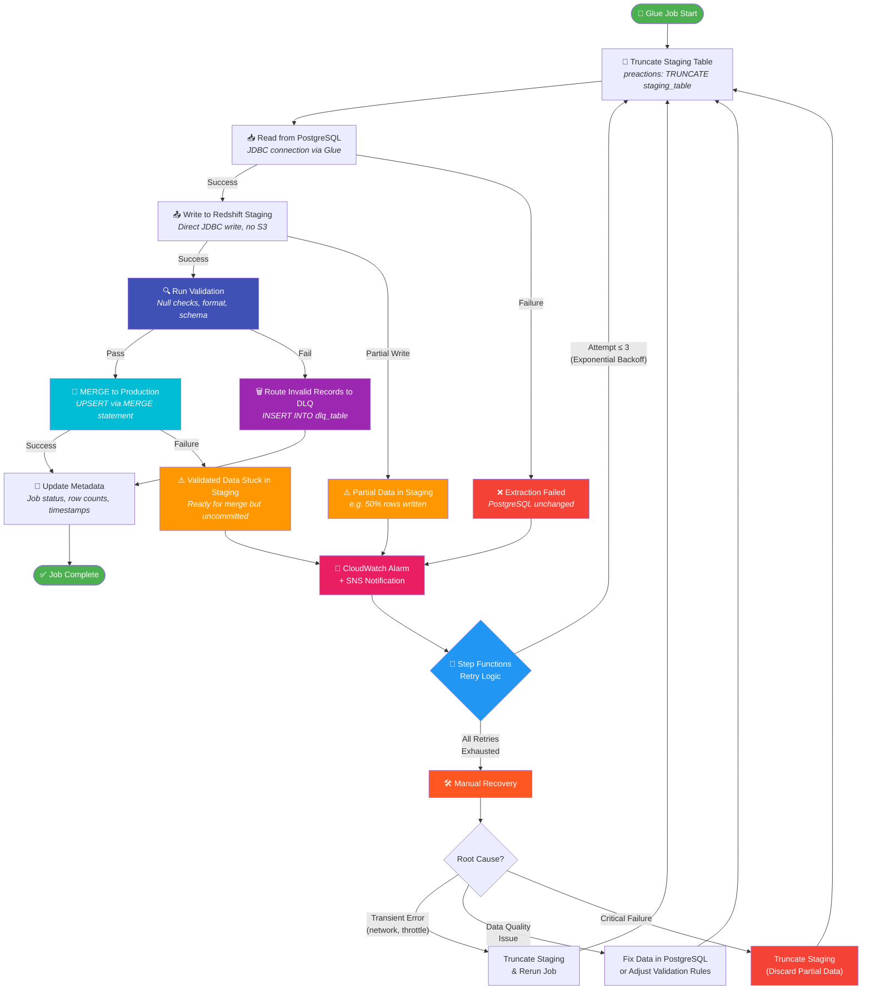
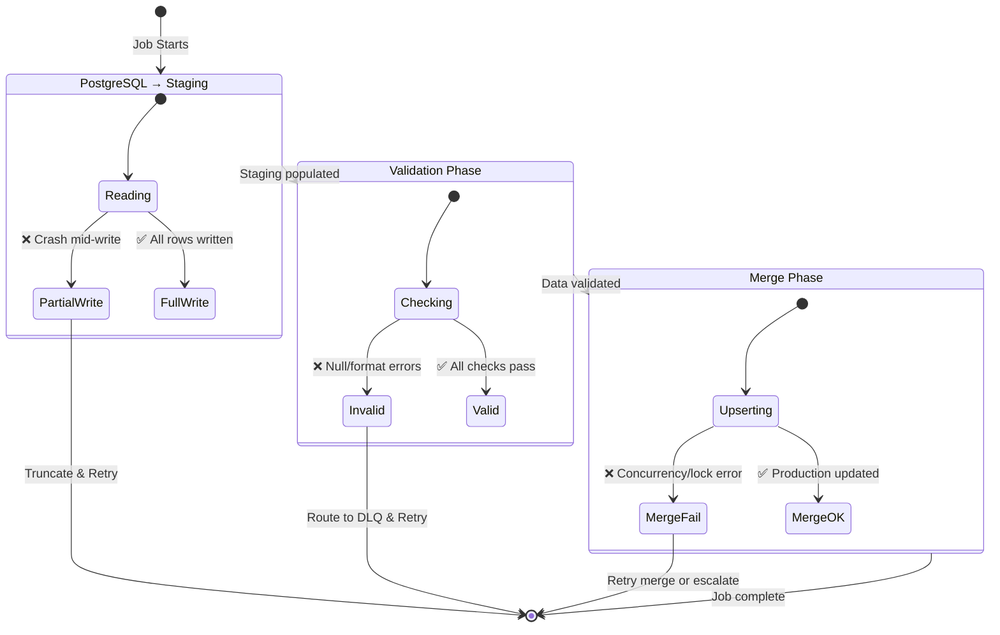
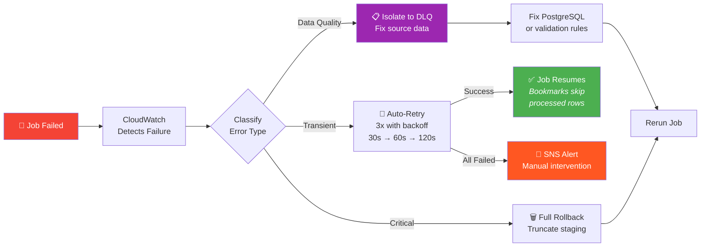
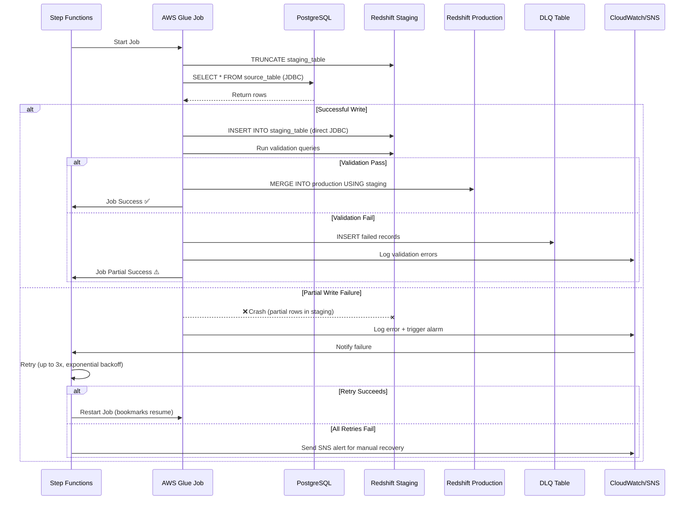

# Handling Partial Writes: PostgreSQL → Glue → Redshift (Direct, No S3)

## Main ETL Flow with Failure Handling

## Data State at Each Failure Point

## Retry & Recovery Decision Tree

## Component Interaction (Sequence)

